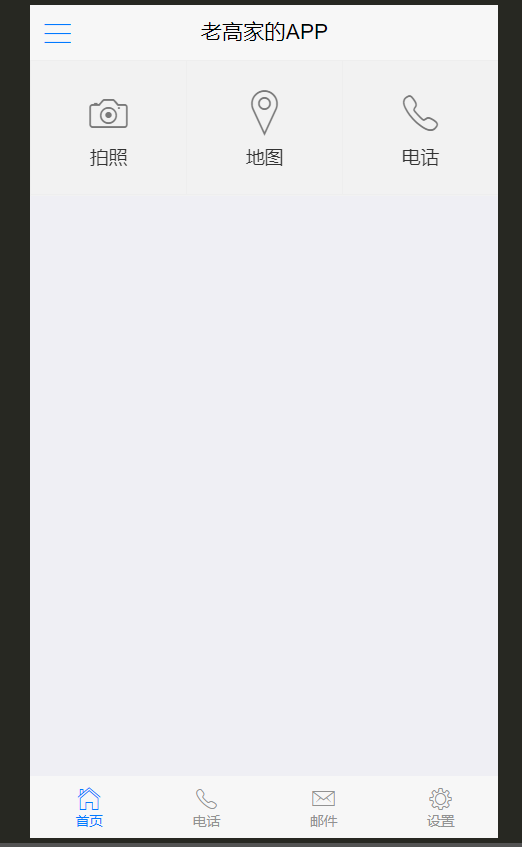

#  Vue进阶

* [ ] 能够实现项目的打包
* [ ] 能够说出开发移动App的几种方式
* [ ] 能够使用HBuliderX把移动端网站打包成移动App
* [ ] 能够说出defineProperty的作用
* [ ] 能够说出服务端渲染和客户端渲染的区别
* [ ] 理解Nuxt的作用
* [ ] 能够理解asyncData的作用 

## 阶段说明和内容介绍

**内容介绍**

1. 打包app

2. MVVM实现原理
   
     会带大家 写一个vue.js, 超简易版的vue.js
   
   1. Object.defineProperty()方法的使用 proxData
   2. 发布订阅模式
   3. 实现MVVM框架
   
3. SSR服务端渲染 =>nuxt框架 => 服务端渲染框架

**阶段说明** 

4. 本阶段的内容**`MVVM`**部分在面试环节Vue部分属于重点项、必问点,常见的面试问题:

   - Vue 数据绑定的原理？
   - MVVM 数据绑定的原理？
   - Vue 双向数据绑定的原理？
   - Vue 数据响应式原理？
   - 数据响应式原理？
   - 数据驱动视图的原理?


## 移动App开发的几种方式

>同学回答:  感觉就一种 H5

1. **`原生App`**  =>  微信/ 支付宝  => 体验 界面审查 流畅度极高 => 开发语言不是h5  安卓 =>  安卓  ios =>ios

    black黑莓 / window phone / 塞班  / 安卓 系统  => java开发 /  ios 系统  => object-c /swift 

2. **`WebApp`**  => 黑马头条 => webapp => 移动网站 => H5 =>vuejs/reactjs/angularjs/jquery/原生js

3. **`HybridApp`**  => 混合开发  => 原生(提供端能力 )+ h5(业务功能 + 调用端能力)

4. **`跨平台开发`** => React-Native => 跨平台 (  安卓/ 苹果 `/ 黑莓 /塞班 / windows phone )`

​            React-Native 是 facebook推出的 可以一套代码 跑在 安卓系统 和 ios系统的 框架, 它是原生的

​           Flutter  => Flutter 是谷歌推出的跨平台 开发项目, 也是原生 跨 安卓 + ios , 非标签形式

```java
import 'package:flutter/material.dart';

void main() => runApp(new MyApp());

class MyApp extends StatelessWidget {
  @override
  Widget build(BuildContext context) {
    return new MaterialApp(
      title: 'Welcome to Flutter',
      home: new Scaffold(
        appBar: new AppBar(
          title: new Text('Welcome to Flutter'),
        ),
        body: new Center(
          child: new Text('Hello World'),
        ),
      ),
    );
  }
}
```


​          开发模式类似  后端开发

​            React-Native 遵循 react开发规范的 原生开发  =>状态机(类似 Vue的响应式数据)

```JSX
import { View, Text  } from 'react-native/components'
class App  extends React.Components {
    // 渲染函数 必须实现 必须返回组件结构 必须有一个根节点
    state = {
       name: '张三'
    }
    render () {
        let { name } = this.state
        return (<View>
                <Text>{ name }</Text>
            </View>)
    }
}
```

weex  => 跨平台框架 ,也可以支持 Vuejs语法规范 

跨平台 最重要的是  =>  生成的代码不是h5, 而是 对应的原生代码,体验 和原生几乎一样

​            Reactjs  =>  遵循react开发规范的H5开发

1. 其他类型(**`小程序`**/**`快应用`**等等)  微信 /支付宝 /百度/抖音/头条/qq/钉钉/高德..

   ...快应用

   

## 移动App开发-(`原生`)NativeApp介绍和特点

**定义**:传统的原生App开发模式，有iOS和Android两大系统，需要各自语言开发各自App。 

**优点**：性能和体验都是最好的, 用的都是本系统的原生组件,没有网络渲染问题

**缺点**：开发和发布成本高  => 需要专业的安卓 和 ios开发人员  ios  系统 闭环 , 应用上传appStore

微信会推出小程序?  ios把握着应用命脉  16

支付宝 也这么想   17

百度也这么想   17

头条也这么想  18-19

qq 也这么想 18-19

钉钉 也这么想

各大手机厂商也这么想

抖音这么想..

**应用技术**：Swift，OC，Java

> 常识: 安卓/iOS/Web 基本都使用Mac进行开发


## 移动App开发-WebApp介绍和特点

[M站演示](https://m.toutiao.com/?)  

**定义**: 移动端的网站，常被称为**`H5应用`**，说白了就是特定运行在移动端浏览器上的网站应用。一般泛指 **`SPA`(**Single Page Application)模式开发出的网站，与**`MPA`（**Multi-page Application）对应。 

8 / 10 / 12 /15

**`优点`**：**开发和发布成本最低** 

1. 开发成本低,可以跨平台,调试方便，开发速度最快

   webapp一般只需要一个前端人员开发出一套代码,然后即可应用于各大主流**`浏览器`**(特殊情况可以代码进行下兼容),没有新的学习成本,而且可以直接在浏览器中调试

2. 维护成本低

   同上,如果代码合理,只需要一名前端就可以维护多个web app

3. 更新最为快速

   由于web app资源是直接部署在服务器端的,所以只需要替换服务器端的文件,用户访问是就已经更新了(当然需要解决一些缓存问题)

4. 无需安装App,不会占用手机内存

   通过浏览器即可访问,无需安装,用户就会比较愿意去用

**`缺点`**：**性能和体验不能讲是最差的**，但也**受到浏览器处理能力的限制**

1. 性能低,用户体验差

   由于是直接通过的浏览器访问,所以无法使用原生的API,操作体验不好

2. 依赖于网络,页面访问速度慢,耗费流量

   Web App每次访问都需要去服务端加载资源访问,所以必须依赖于网络,而且网速慢时访问速度很不理想,特别是在移动端,如果网站优化不好会无故消耗大量流量

3. 功能受限,大量功能无法实现

   只能使用Html5的一些特殊api,无法调用原生API,所以很多功能存在无法实现情况

4. 临时性入口,**`用户留存率低`**, 这个**`几乎是不可原谅`**的

   这既是它的优点,也是缺点,优点是无需安装,缺点是用完后有时候很难再找到,或者说很难专门为某个web app留存一个入口,导致用户很难再次使用

**应用技术**：**`ReactJS`**，**`AngularJS`**，`VueJS`等等 


## 移动App开发-HybridApp介绍和特点

WebView => 原生浏览器的内置浏览器

**定义**:混合模式移动应用，介于**`Web App`、`Native App`**这两者之间的App开发技术，兼具“Native App良好交互体验的优势”和“Web App跨平台开发的优势” ,**原生客户端的壳`WebView`，其实里面是HTML5的网页**

>webview 就是一个内置的浏览器  => 里面是我们做的 h5的网页  外面是一个安卓或者 ios的**`壳`**  只提供 API,不做具体业务   

举例 :  电商app ,  所有的业务 都是h5网页, 外面的壳 是安卓或者ios,提供SDK(调用原生能力的包) / 拍照/录像/录音/   h5网页  => js  调用 原生能力 

- 把网页打包成移动 App
- 使你的 Web 程序可以访问手机原生能力

**`优点`**：开发和发布都比较方便，效率介于Native App、Web App之间 

1. 开发成本较低,可以跨平台,调试方便

   Hybrid模式下,由原生提供统一的API给JS调用,实际的主要逻辑有Html和JS来完成,而由于最终是放在webview中显示的,所以只需要写一套代码即可,达到跨平台效果,另外也可以直接在浏览器中调试,很为方便

   最重要的是只需要一个前端人员稍微学习下JS api的调用即可,无需两个独立的原生人员

   一般Hybrid中的跨平台最少可以跨三个平台:Android App,iOS App,普通webkit浏览器

2. 维护成本低,功能可复用

   同上,如果代码合理,只需要一名前端就可以维护多个app,而且很多功能还可以互相复用

3. 更新较为自由

    混合开发 实际上 就是 安卓的壳 /ios壳  +  html/js/css 

   更新的话 只需要 下载最新的  html+js+css(**`本地模式`**)

   安卓的壳 /ios壳  + webview(**`线上地址`**)(**`线上模式`**)  => 更新只需要部署到服务器即可 (性能和效率是比较低)

   虽然没有web app更新那么快速,但是Hybrid中也可以通过原生提供api,进行资源主动下载,达到只更新资源文件,不更新apk(ipa)的效果  (进入之后**`热更新`**)

4. 针对新手友好,学习成本较低

   这种开发模式下,只需要前端人员关注一些原生提供的API,具体的实现无需关心,没有新的学习内容,只需要前端人员即可开发22

5. 功能更加完善,性能和体验要比起web app好太多

   因为**`可以调用原生api`**,所以很多功能只要原生提供出就可以实现,另外性能也比较接近原生了

6. 部分性能要求的页面可用原生实现

   H5实现不了的 原生来做 

   > 一般来说 壳+html+js+css , 壳+ 部分原生 + html/js+css
   
   这应该是Hybrid模式的最多一个好处了,因为这种模式是原生混合web,所以我们完全可以将交互强,性能要求高的页面用原生写,然后一些其它页面用JS写,嵌入webview中,达到最佳体验

**缺点**：学习范围较广，需要原生配合 

1. 相比原生,性能仍然有较大损耗

   这种模式**受限于webview**的性能桎梏,相比原生而言有不少损耗,体验无法和原生相比

2. 不适用于交互性较强的app

   这种模式的主要应用是:一些新闻阅读类,信息展示类的app;但是不适用于一些交互较强或者性能要求较高的app(比如动画较多就不适合)

**应用技术**：[Cordova](https://cordova.apache.org/)、[APPCan](http://www.appcan.cn/)、 [DCloud](https://dcloud.io/) 、[API Cloud ](https://www.apicloud.com/)


一般大公司不会用这些壳,大公司有能力 有资本 有能力自己做原生 自己封装sdk, 比如 支付宝 / 微信 .. 抖音 ./头条

**四种方式对比**


## 移动App开发-跨平台开发介绍和特点

> 特点：使用类似于 Web 技术的方式来开发 Native App。
>
> React Native (原生开发)和 reactjs(h5开发)是两回事  => 同时都用jsx语法 ,都用react语法规范  状态机 state (React)  Vue (data)

**定义**: **`Facebook`**发现Hybrid App存在很多缺陷和不足，于是发起开源的一套新的App开发方案**`React Native`**。使用**`JSX语言`**写原生界面，js通过JSBridge调用原生API渲染UI交互通信。

```js
import React from 'react'
import Menu  from 'menu'
// 定义一个组件叫App react 16.8之前的语法
class App extends React.Component {
    // render函数  渲染方法 要求必须返回一个元素 元素只能有且只有一个根节点
    // 标签 闭合标签 和 js逻辑混写
    // state 
    state = {
        name : '张三'
    }
    changeName () {
       // this.name = '李四'
         // 改变张三为李四
        this.setState({ 
            name: '李四'
        })
    }
    render () {
        return <div>
          <p>  { this.state.name  }  </p>
          <button onClick={this.changeName.bind(this)}>改变name</button>
          <Menu />
        </div>
    }
}
// 16.8之后 推出了函数式的组件  react hooks
```

React-Native 就是**`用js的方式 去开发 原生应用那个 一套代码  安卓/ios上面`**

招人的 时候 会说 => 招聘 React-Native工程师, 具备安卓和ios 相关一些背景, Android Studio  /  XCode

**`优点`**：效率体验接近Native App，发布和开发成本低于Native App

1. 虽然说开发成本大于Hybrid模式,但是小于原生模式,大部分代码可复用

   相比于原生模式,这种模式是统一用JS写代码,所以往往只需要一名成员投入学习,即可完成跨平台app的开发,而且后续代码封装的好,很多功能可复用

2. 性能体验高于Hybrid,不逊色与原生

   这种模式和Hybrid不一样,Hybrid中的view层实际上还是dom,但是这种模式的view层是虚拟dom,所以性能要高于Hybrid,距离原生差距不大

   这种模式可以认为是用JS写原生,即页面用JS写,然后原生通过Bridge技术分析JS,将JS内容单独渲染成原生Android和iOS,所以也就是为什么性能不逊色原生

3. 开发人员单一技术栈,一次学习,跨平台开发 

   这种模式是统一由JS编写,有着独特的语法,所以只需要学习一次,即可同时开发Android和iOS

4. 社区繁荣,遇到问题容易解决

   这应该是React Native的很大一个优势,不像Hybrid模式和原生模式一样各自为营,这种模式是Facebook统一发起的,所以有一个统一的社区,里面有大量资源和活跃的人员,对开发者很友好

**`缺点`:** 学习有一定成本，且文档较少，免不了踩坑  

1. 虽然可以部分跨平台,但并不是Hybrid中的一次编写,两次运行那种,而是不同平台代码有所区别

   这种模式实际上还是JS来写原生,所以Android和iOS中的原生代码会有所区别,如果需要跨平台,对开发人员有一定要求

   当然了,如果发展了有一定时间,组件库够丰富了,那么其实影响也就不大了,甚至会比Hybrid更快

2. 开发人员学习有一定成本

   虽然社区已经比较成熟了,但是一个新的普通前端学习起来还是有一定学习成本的,无法像Hybrid模式一样平滑

3. 学习成本大，对开发人员技术要求比较高

4. 不懂原生开发很难驾驭好

5. 说是使用 Web 技术进行开发，还是多少得学点儿原生 App 开发，才能处理好跨平台。

6. 前期投入比较大，后劲很足。

**应用技术** :

**React Native（主流）**

- 公司：Facebook
- 技术栈：React
- 基于React开发App的框架RN

**其他技术**: 

**Weex（使用不多）**

- 公司：Apache 开源基金会
- Vue.js 技术栈
- 基于Vue开发App的框架WEEX

**Flutter（未来趋势）**

- 公司：Google
- 它提供了官方的原生 UI 组件
- 比 RN、Weex 之类的体验更好  =>代码 不像前端代码 => 代码更接近于后端
- 开发语言：Dart（和 JavaScript 很像）
- 商业应用：闲鱼


## 移动App开发-其他类型App

> 小程序

- **微信小程序**

- 百度小程序

- 头条小程序

- 支付宝小程序

- 快应用 ...  10大手机厂商推出的

  > 本质
  
- 混合开发 + 微信搞了一套 微信小程序的开发规范  => vue /react 

- 混合开发 + 支付宝搞了一套微信小程序的开发规范 

> 统一开发平台

- taro(京东)->坑多 趋势很好 是有react 为基础的开发语言规范
- uni-app    是以 vuejs为基础开发语言规范

>一套代码 开发多套 应用  
>
>taro  -> 是以 React为语法规范   => 只需要写一遍代码  =>对应编译成不同的端
>
>uni-app 是以 vue语法规则
>
>Chameleon 是滴滴的也是 一端多用
>
>mpVue 美团的应用  一端多用

**`微网页`**

- **微信公众号** /在微信中嵌入了h5页面
- 百度直达号  /在百度中嵌入了h5页面
- 。。。

**`快应用`**

9大手机厂商 => 联合推出 了一个标准  =>体验接近原生 => 但是坑巨多,流量巨少

- 各大手机厂商联合制定推出的一种方式，类似于小程序
- 使用 Web 技术进行开发， 而且提供了在 Web 中访问手机硬件等底层交互的 API
- 属于混合 App 的一种方式

**`PWA`**（网站离线访问技术，没有 iPhone 不参与）

- 它可以让网站拥有一个类似于 App 的入口
- 提供了网站的离线应用访问
- Google 在推动
- 手机端目前只能在 安卓手机的 Chrome 浏览器运行

## 移动App开发-开发模式对比和选择

各大开发模式对比

|                      | Native App                   | Web App                       | Hybrid App                   | React Native App              |
| :------------------- | :--------------------------- | :---------------------------- | :--------------------------- | :---------------------------- |
| 原生功能体验         | 优秀                         | **差**                        | 良好                         | **接近优秀**                  |
| 渲染性能             | 非常快                       | 慢                            | 接近快                       | 快                            |
| 是否支持设备底层访问 | 支持                         | 不支持                        | 支持                         | 支持                          |
| 网络要求             | 支持离线                     | 依赖网络                      | 支持离线(资源存本地情况)     | 支持离线                      |
| 更新复杂度           | 高(几乎总是通过应用商店更新) | 低(服务器端直接更新)          | 较低(可以进行资源包更新)     | 较低(可以进行资源包更新)      |
| 编程语言             | Android(Java),iOS(OC/Swift)  | js+html+css3                  | js+html+css3                 | 主要使用JS编写,语法规则JSX    |
| 社区资源             | 丰富(Android,iOS单独学习)    | 丰富(大量前端资源)            | 有局限(不同的Hybrid相互独立) | 丰富(统一的活跃社区)          |
| 上手难度             | **难(不同平台需要单独学习)** | 简单(写一次,支持不同平台访问) | 简单(写一次,运行任何平台)    | **挺等(学习一次,写任何平台)** |
| 开发周期             | 长                           | 短                            | 较短                         | 中等                          |
| 开发成本             | 昂贵                         | 便宜                          | 较为便宜                     | 中等                          |
| 跨平台****           | **不跨平台******             | **所有H5浏览器**              | Android,iOS,h5浏览器****     | **Android,iOS**               |
| APP发布              | App Store                    | Web服务器                     | App Store                    | App Store                     |

>  如何选择开发模式

目前有多种开发模式,那么我们平时开发时如何选择用哪种模式呢？如下

* 选择纯Native App模式的情况

- 性能要求极高,体验要求极好,不追求开发效率

  一般属于吹毛求疵的那种级别了,因为正常来说如果要求不是特别高,会有Hybrid

> 选择Web App模式的情况

- 不追求用户体验和性能,对离线访问没要求

  正常来说,如果追求性能和体验,都不会选用web app

- 没有额外功能,只有一些信息展示

  因为web有限制,很多功能都无法实现,所以有额外功能就只能弃用这种方案了

* 选择Hybrid App(混合开发)模式的情况

- **大部分情况下的App**都推荐采用这种模式

  这种模式可以用原生来实现要求高的界面,对于一些比较通用型,展示型的页面完全可以用web来实现,达到跨平台效果,提升效率

  当然了,一般好一点的Hybrid方案,都会把资源放在本地的,可以减少网络流量消耗

> 选择React Native App模式的情况

- 追求性能,体验,同时追求开发效率,而且有一定的技术资本,舍得前期投入

  React Native这种模式学习成本较高,所以需要前期投入不少时间才能达到较好水平,但是有了一定水准后,开发起来它的优势就体现出来了,性能不逊色原生,而且开发速度也很快

> 选择其它方案

- **小程序**（目前移动 App 中开发难度最低的，体验也是仅次于原生+跨平台NativeApp）

## HTML5+介绍-HBuliderX安装和完整示例项目

> DClound是什么?  HTML5+又是什么?

[DClound官网](https://www.dcloud.io/index.html)

DCloud面向HTML5行业分别推出了开发工具**`HBuilder`**、手机强化引擎**`5+ Runtime`**、**`前端框架mui`**，通过系列产品对HTML5的强化支持，使得HTML5能达到原生的功能和体验，同时在发行上更优于原生应用。

>这里 **`Hbuilder`**是开发工具, **`mui`**是前端UI框架(类似于vant),但不是Vue技术栈,**`5+ Runtime`**是  一个手机强化引擎, 相当于一个**`强化版的webview`**(让浏览器拥有了原生的能力) 拍照/录音/二维码 ...

DClound做了很多事情, 开发工具, 前端框架, 浏览器引擎,我们通过一个例子来认识它

>接下来 ,我们希望完成一个轻量**`混合应用`**的开发, **`混合应用`** 即  H5 + 原生, 但是我们并没有 原生SDK,这个时候就可以借助 **`5+ RunTime`** 来做, 那么我们的界面 恰好可以用 它专属的mui来布局设计
>
>OK, 那么接下来,我们尝试 在**`HBuilderX`**中,开发一个**`混合应用`**,利用**`mui`**做布局,利用 **`5+ RunTime`**提供原生能力

 **`开始!`**

>第一步, 我们需要先下载[HbuilderX开发版](https://www.dcloud.io/hbuilderx.html)

>第二步, 我们创建一个项目,但是我们创建项目的时候,惊呆了!因为Hbuilder可以创建 各种类型的项目
>
>简单说一下:  

>普通项目  =>  普通H5项目, Hbuilder内置了几套模板,作用不大,同学们基本都会自己创建
>
>uni-app   => 多端应用,一套代码,复用八端,时下最火的一个跨端框架
>
>wap2App  =>wap项目转 App , 原来只运在手机上的wap(无线网络协议,诺基亚,爱立信时代)项目 可转app项目
>
>5+ App  =>  利用DCloud 的 **`5+ Runtime`**来做原生能力提供者的 项目
>
>小程序  =>  微信原生小程序的另外一个编辑器,比微信提供的开发者工具好用,但是现在谁还在用原生写小程序呢?
>
>快应用  => 原生快应用 编辑器 , 较为冷门的生态, 目前不太热闹

我们要选择5+App 项目,我们说了要用 mui前端框架,所以选择一个mui项目

>第三步,项目创建好之后,我们着手对界面进行设计和开发,  [mui文档](https://dev.dcloud.net.cn/mui/getting-started/)
>
>hbuilderx提供了很多简单快速的快捷键,我们简单学习两个即可,在body中输入 **`moffcanvas`**,会给出 mui几套基础界面的提示 我们随便选择一个 **`moffcanvas`**(侧滑导航,主界面,菜单同时移动)

>第四步 ,我们在页面中输入一个九宫格 **`mGrid`**, 然后 把图标换成  拍照 / 地图 / 电话 / 信息



OK,我们经过几步 完成了这样一个页面,**`注意`**,**`我们的目的并不是学习mui`**,而是体验DCloud,这个世界上的前端框架何止几百种,永远是学不完的,开发只会用一种前端UI, 我们通过对于这个示例的学习进而了解 混合开发


> 我们的界面搭建完毕, 接下来我们要尝试去调用摄像头 和 地图 以及电话

## HBuliderX 中 5+RunTime的使用和测试

> 我们已经完成了H5页面, 我们知道混合开发其实是 H5 + 原生能力,现在H5有了,原生能力在哪?

>老高告诉你,**`你已经有了原生能力`**! 
>
>**`what ?`**   **`Are you Kidding  me`** ?
>
>没错! 我们创建的项目是 5+ Runtime,  这个项目本身就自带原生能力的, 究其原因就是因为 我们的项目中多了一个文件 **`manifest.json`**   [说明地址](https://ask.dcloud.net.cn/article/94),该文件是一个w3c的webapp配置文件
>
>HbuilderX 给我们的页面中注入了个全局对象 **`plus`**, 这个plus就是我们的原生能力
>
>我们可以在页面中监听plus初始化完成的事件

```js
	document.addEventListener('plusready', function(){
			console.log('原生能力准备好了')
    })
```

**`在模拟器/真机测试`**

>接下来,我们尝试在模拟器或者真机中运行 我们写好的程序. 如果你没有安卓手机, 那么你只能选择模拟器来测试

这里推荐一个[夜神模拟器](https://www.yeshen.com/),值得注意的是,我们需要把HbuilderX的安卓调试设置为**`62001`**,否则将不能连接


>真机调试,需要将手机的开发者选项打开,并且启动usb调试, **`注意`** 必须采用数据线连接

在选中当前项目的情况下 , 在 HBuilder 中找到：运行 -> 运行到手机或模拟器 -> 你的设备

[HBuilder/HBuilderX真机运行、手机运行、真机联调常见问题](http://ask.dcloud.net.cn/article/97)

**`开发简单的几个小功能`**

* [5+ Runtime的文档 ](http://www.html5plus.org/doc/zh_cn/camera.html)

>第一步,我们想拍张照片然后放在页面上, 刚说了**`plus`**是我们的原生能力,怎么调摄像头拍照?
>
>[拍照API](http://www.html5plus.org/doc/zh_cn/camera.html)
>
>拍照代码
>
>```js
>var takePhoto = function (){
>		  var carmera =	plus.camera.getCamera(1) // 获取主摄像头对象
>		    carmera.captureImage(function(url){
>				// 注意这个地址不能用 需要转化
>				// 需要将相对手机路径变成绝对路径
>			 let absoluteUrl = plus.io.convertLocalFileSystemURL(url)
>			  // 我们把地址放到一个新的图片上
>			  document.getElementById("myImg").src = absoluteUrl
>			})
>		}
>```

>第二步,我们进行地图的定位, 我们希望做一个 在高德地图中 显示**`黑马校区位置`**的 功能

>[地图API](http://www.html5plus.org/doc/zh_cn/maps.html)
>
>地图代码  => 我们单独新建一个页面 map.html 专门放置 地图导航
>
>地图页面的模板
>
>```js
><!doctype html>
><html>
>
>	<head>
>		<meta charset="utf-8">
>		<title></title>
>		<meta name="viewport" content="width=device-width,initial-scale=1,minimum-scale=1,maximum-scale=1,user-scalable=no" />
>		<link href="css/mui.css" rel="stylesheet" />
>		<style type="text/css">
>			#app {
>				width: 100%;
>				position: fixed;
>				top: 0;
>				left:0;
>				height: 100%;
>				background-color: #0062CC;
>			}
>		</style>
>	</head>
>
>	<body>
>		<script src="js/mui.js"></script>
>		<script type="text/javascript">
>			mui.init()
>		</script>
>		<div id="app">
>			地图加载中...
>		</div>
>		<script type="text/javascript">
>			// 模拟器没有地图 只能在真机上测试
>		var initMap = function () {
>			// 初始化地图
>			var  map =	new plus.maps.Map("app")  // 实例化一个map对象
>			map.setCenter(new plus.maps.Point(116.635699, 40.169122))  // 设置中心点
>		}
>		// 下面代码用来保证 执行初始化地图时  plus是一定有值
>         if(window.plus) {
>			 // 如果plus存在表示 此时已经初始化原生能力 结束
>			 initMap()
>		 }else{
>			 document.addEventListener("plusready", initMap)
>		 }
>		</script>
>	</body>
>
></html>
>
>```
>
>设置坐标点
>

>接下来 ,我们做最后一个功能 打电话 ,就打给 联通客服 10010
>
>[硬件API](https://www.html5plus.org/doc/zh_cn/device.html)

>直接上代码
>
>```js
>// 打电话 
>		var takePhone = function () {
>			plus.device.dial('10086')
>		}
>```

需要注意的是: **`地图/电话 这两个功能只能在真机上测试哦`**

## HBuliderX打包开发示例

>OK, 我们上一节,做了一个小小的混合应用,这个应用我们想要让别人安装使用, 需要把我们新建的 **`5+App`**
>
>打包成一个 安卓的apk 或者 苹果的 .ipa
>
>注意: 打包工作 **`目前不是`**我们作为前端开发的重点, 只有掌握了精湛的前端技术, 熟练的开发各种移动应用之后,才有可能 有机会 去做类似的工作,所以这里我们尝试去练习,我们的重难点 还在 vue/react 这些技术栈上,
>
>而不是把时间放在配置各种乱七八糟的前端打包编译环境上,假以时日,技术成熟,再来搞也不迟

配置[mainfest.json](http://ask.dcloud.net.cn/article/94)文件 , 此文件是配置我们app的各种配置,例如 图标,权限,启动屏

>我们设置一个图标 和启动屏幕,具体参照视频操作,
>
>这里**`需要特别注意`**::由于我们用了**`百度地图`**功能, 所以打包的时候需要用一个公共的sdk的api_key,
>
>需要到百度开发者中心注册一个账号,得到一个地图的key
>
>[操作文档](https://ask.dcloud.net.cn/article/29)


>接下里, 我们进行打包,
>
>在 HBuilder 中找到：发行 -> 原生 App（云打包）
>
>等待一段时间，得到打包结果安装包，然后安装到手机上测试
>
>最后根据需要发布到对应的手机应用商店

**`注意`**, 打包本身分两种, 一种**`本地打包`**,一种**`云打包`**

本地打包**`需要配置`**  安卓以及苹果的开发打包环境  [安卓本地打包说明](https://ask.dcloud.net.cn/article/508)

云打包 是把我们的资源提交到DCloud服务器, 由DCloud完成打包

后者 比较简单不需要 环境安装, 我们此次采用云打包方式

> 一般在企业中还是 本地打包居多,因为谁都不想把自己的开发好的东西提交到别人的服务器

* 云打包提交之后,稍等几分钟, 此时 DCloud 会返回一个下载链接 (只允许下载5次),我们可以下载尝试安装

一切顺利,安装完毕. 

>虽然成功了, 但是我们也清楚的看到, 打包并不是那么简单,有很多环境,属性细节需要设置 调整.

## HBuliderX打包黑马头条

> 通过HBuliderX将黑马头条项目打包成app,生成apk文件下载安装测试
>
> 黑马头条我们已经完成, 此时来讲黑马头条打包成 App

**`值得注意`**的是: 我们的黑马头条就是H5, H5就是运行在浏览器中的, 只不过运行在 **`5+ Runtime`**这个增强版浏览器里面, 浏览器和 APP的物理按钮并没有进行关联, 也就是 点击手机返回按钮, 浏览器并不会进行返回

所以我们需要在我们的 页面中 对物理返回按键进行一下处理

>下面的代码 就是   **`5+ Runtime`**的处理物理返回按钮的问题

```js
// 在main.js中添加如下代码  此代码是采用的 5+ Runtime中的plus对象
document.addEventListener('plusready', function () {
  var webview = window.plus.webview.currentWebview()
  window.plus.key.addEventListener('backbutton', function () {
    webview.canBack(function (e) {
      if (e.canBack) {
        webview.back()
      } else {
        // webview.close(); //hide,quit
        // plus.runtime.quit();
        // 首页返回键处理
        // 处理逻辑：1秒内，连续两次按返回键，则退出应用；
        var first = null
        window.plus.key.addEventListener('backbutton', function () {
          // 首次按键，提示‘再按一次退出应用’
          if (!first) {
            first = new Date().getTime()
            setTimeout(function () {
              first = null
            }, 1000)
          } else {
            if (new Date().getTime() - first < 1500) {
              window.plus.runtime.quit()
            }
          }
        }, false)
      }
    })
  })
}) 
```

> 这个代码注入之后,我们还**`缺少一个mainfest.json文件`**,这个文件我们如何自己创建,里面过多内容根本不知道怎么如何测试!
>
> 我们直接新建一个**`5+App`**项目 然后,配置好app信息之后,直接将 unpackage(图标)/ mainfest.json(配置文件)
>
> 拷贝到黑马头条的**`public`**目录下, 打包完成之后 public目录就自动拥有该配置,然后我们打包 dist目录就可以了

>最终一切结束, apk 安装到了模拟器或者手机 进行测试吧

