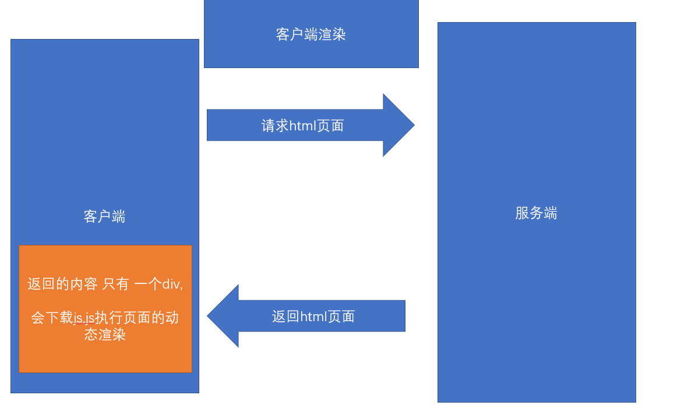
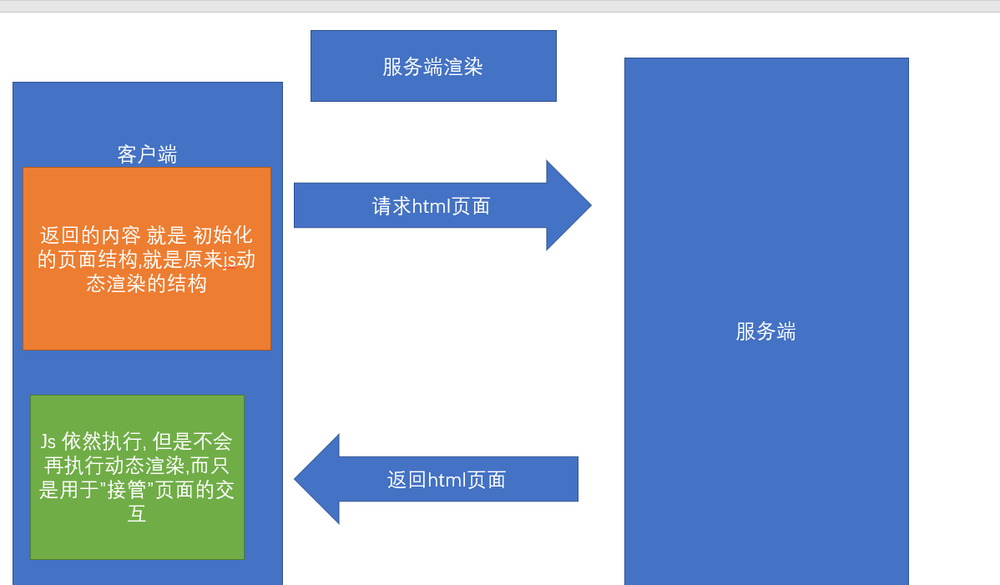

##  CSR演示和特点 - 客户端渲染

> 什么是CSR ?  同学们:其实这种类似字母的堆积都是 单词的缩写拼接

**`Client Side Render`** , 也就是在客户端渲染,我们请求的Html页面中并没有核心内容,而是需要下载执行 js 文件，由浏览器动态生成页面，并通过 JS 进行页面交互事件与状态管理

简单一句话 : **`页面的主体结构是请求完js,由js完成的渲染`**

> 客户端渲染的优势是什么?

 适合前后端分离开发，方便维护，单页应用中几乎都是客户端渲染,像我们的黑马头条 都是客户端渲染

> 缺点呢? 难道没缺点?

**`首次加载慢`，`不利于 SEO`** , 因为我们的大部分动态结构 都是在客户端渲染的,后端返回的只是一个空的div,

因为首次加载需要先把js加载完毕,然后才能去渲染

SEO => 搜索引擎优化 => H5页面 => 百度/头条 => 爬虫爬取网页的结构./关键词/语义化标签

> 上述的效果可通过查看 黑马头条的网页元素进行验证
>
> 

## SSR渲染的演示和特点-服务端渲染

> 什么是SSR ? 和 CSR一个字之差! SSR其实就是 把Client换成了Server, 客户端渲染变成了服务端渲染

**`Server Side Render`** (服务端渲染 **SSR**)：服务器直接**`生成 HTML 文档结构`** 返回给浏览器，但页面交互能力有限。适合于任何后端语言：PHP、Java、Python、Go, ASP 等。aspx => 很多服务器标签

JSP  => 服务端渲染 =>  服务端标签 => 完成数据的替换 => html =>  浏览器

ASP => 服务端渲染 => 服务端标签  => 完成数据的替换 => html =>  浏览器

服务端渲染速度更快, 因为直接返回了文档结构,立刻能看到文档效果

相当于 在服务端完成了页面的结构的生成 => 返回生成好的页面结构 =>不需要js请求完毕就有内容

> 服务端渲染 的优势是什么?

响应速度快(首屏渲染速度快)，有利于 SEO, 不需要等待js, 就好像你访问的是静态页面一样

> 劣势 ?

* 前后端代码混合在一起，难以开发和维护，不适合进行前后端分离开发

前后一体 =>  前后分离 => 服务端渲染  =>     中间件(只做服务端渲染)  =>  服务端(主)

>服务端页面返回的内容直接是Html文档结构,不用等到下载完js,再通过js去渲染
>
>

## Vue的SSR介绍及示例演示

> Vue的SSR(服务端渲染)是什么?

Vue.js 是构建客户端应用程序的框架。默认情况下，可以在浏览器中输出 Vue 组件，进行生成 DOM 和操作 DOM。然而，也可以将同一个组件渲染为**`服务器端的 HTML 字符串`**，将它们直接发送到浏览器，最后将这些静态标记"激活"为客户端上完全可交互的应用程序。

[Vue的SSR文档](https://ssr.vuejs.org/zh/) 

**`Vue的SSR代码既包含客户端部分,又包含服务端部分`** 

基于react、vue框架，客户端渲染和服务器端渲染的结合，在服务器端执行一次，用于实现服务器端渲染（首屏直出），在客户端再执行一次，用于**`接管页面交互`**，核心解决SEO和首屏渲染慢的问题。

> 上面这段话的意思是, 在服务端 生成页面结构, 页面结构返回给了客户端浏览器, 然后下载运行js, js同样也会执行,但是并不会再次执行渲染,而是直接接管了页面的交互, 比如点击事件.业务操作

接下来,我们运行一个官方的小例子看看效果

> 首先,我们需要新建一个文件夹  ssrDemo, 并在该目录下初始化 npm

```bash
$ npm init -y 
```

> 然后,我们来安装 Vue 和 Vue 服务端渲染包

```bash
$ npm  install vue vue-server-renderer --save
```

> 然后 在该目录下 新建一个 app.js,内容如下

```js
// 第 1 步：创建一个 Vue 实例
const Vue = require('vue')
const app = new Vue({
  template: `<div>Hello World</div>`
})

// 第 2 步：创建一个 renderer
const renderer = require('vue-server-renderer').createRenderer()

// 第 3 步：将 Vue 实例渲染为 HTML renderToString 返回一个promise
renderer.renderToString(app).then(html => {
  console.log(html)
}).catch(err => {
  console.error(err)
})
```

> 我们可以直接用命令执行 看看能输出什么内容

```bash
$ node app
```


>试着写一些动态内容

```js
const Vue  = require('vue') //  为什么不能用import  因为这里是后端代码
const  render  = require('vue-server-renderer')  
// 服务端渲染包 此模板 可以获取vue实例的html内容
const SSR = render.createRenderer() // 创建一个 服务端渲染实例化对象  
// 第一步 创建一个vue实例
const app = new Vue({
    template: `<div>Hello world :{{  name }}</div>`,
    data: {
        name: '程序猿'
    }
})
// 第二步 对vue实例进行 渲染 得到其html结构
SSR.renderToString(app).then(html => {
    // 得到渲染的结构
    console.log("得到服务端渲染的结构是:" + html)
}) // 将组件或者vue实例化 转化成字符串

// 我们要将这个结果 返回浏览器  浏览器直接显示这个结构  这就是服务端渲染
```


> 我们发现代码动态数据直接渲染成了真正的字符串

OK, 既然可以生成最终的页面字符串, 我们可以和express进行结合,写一个最终版的服务端渲染示例

> 首先安装express

```bash
$ npm  i express
```

> 然后新建 server.js , 将 app.js  的数据进行返回

首先,将app.js的内容导出

```js
const Vue  = require('vue') //  为什么不能用import  因为这里是后端代码
const  render  = require('vue-server-renderer')  
// 服务端渲染包 此模板 可以获取vue实例的html内容
const SSR = render.createRenderer() // 创建一个 服务端渲染实例化对象  
// 第一步 创建一个vue实例
const app = new Vue({
    template: `<div>Hello world :{{  name }}</div>`,
    data: {
        name: '程序猿'
    }
})
// // 第二步 对vue实例进行 渲染 得到其html结构
// SSR.renderToString(app).then(html => {
//     // 得到渲染的结构
//     console.log("得到服务端渲染的结构是:" + html)
// }) // 将组件或者vue实例化 转化成字符串
module.exports = SSR.renderToString(app)  // 直接导出 promise对象
// 我们要将这个结果 返回浏览器  浏览器直接显示这个结构  这就是服务端渲染
```

然后,在server.js 中通过express 开启服务端口监视,并将导出的模板字符串 进行返回,代码如下

```js
var server = require('express')()  // 实例化web服务
var app = require('./app')
server.get('/', function (request, response) {
    //  当请求地址是/ 进行处理
    app.then(html => {
        response.send(`
        <!DOCTYPE html>
<html lang="en">
<head>
    <meta charset="UTF-8">
    <meta name="viewport" content="width=device-width, initial-scale=1.0">
    <title>大家好,老高的课结束在即</title>
</head>
<body>
     ${html}
</body>
</html>`)
        // 需要把动态渲染的内容直接返回
    })
  
})
server.listen(10086,function () {
    console.log("您的web服务启动了,访问地址 http://localhost:10086/")
})
```

OK了, 访问对应的地址 ,通过审查元素,我们发现返回的页面直接是已经组装好的页面结构,

同志们! 这就是**`纯服务端渲染`**

## Nuxt介绍

> 上个小节中,我们的服务端内容觉得还好啊,不难啊,挺好用啊 , **`But`**!真实的案例往往超乎你的想象,
>
> 我们并不可能只返回一个字符串,然后没有任何交互, 交互只能在客户端做啊!

服务端渲染=> 解决首屏渲染问题,SEO不够友好

怎么办? 我们并不是只有服务端内容, 不能为了解决这个问题,把交互给丢了

> 所以在既有服务端,又有客户端的情况下,我们的代码好像并不能用了
>
> 此时 带来第三方基于Vue的服务端渲染框架Nuxt

需要大家注意的是:

[说明](https://zh.nuxtjs.org/guide) 

1. Nuxt**`不是`**Vue官方提供的
2. Nuxt是**`基于Vue`**的服务端渲染的框架
3. Nuxt.js 预设了利用 Vue.js 开发**`服务端渲染`**的应用所需要的各种配置。

> nuxt有什么作用?

基于 Vue、Webpack 和 Babel Nuxt.js 集成了以下组件/框架，用于开发完整而强大的 Web 应用：

1. [Vue 2](https://github.com/vuejs/vue)
2. [Vue-Router](https://github.com/vuejs/vue-router)
3. [Vuex](https://github.com/vuejs/vuex) (当配置了 [Vuex 状态树配置项](https://zh.nuxtjs.org/guide/vuex-store) 时才会引入)
4. [Vue 服务器端渲染](https://ssr.vuejs.org/en/) (排除使用 [`mode: 'spa'`](https://zh.nuxtjs.org/api/configuration-mode))
5. [Vue-Meta](https://github.com/nuxt/vue-meta)

>看到了没? 

vue-cli 是 vuejs 官方的脚手架, 用来开发纯前端项目,不负责服务端渲染

nuxt脚手架 是 第三方团队推出的, 和vue-cli 半毛钱关系没有

Nuxt里面拥有我们开发纯前端项目的一切配置,用于开发完整强大的web应用

我们用了nuxt,我们的项目就不再是一个纯前端项目了, 而是一个包含**`服务端渲染`**的前后端项目

服务端 + 客户端  => nuxt项目 ,并不会丢弃我们原来的前端内容

只不过 **`把每个组件的首屏渲染放在了 服务端 而不是客户端`**

## Nuxt创建项目

> 说了这么半天, Nuxt怎么用, 我们怎么用它开发项目?

来做个例子看看吧

> 首先我们来新建个文件夹  nuxtDemo  初始化 npm

```bash
$ npm init -y 
```

> 然后在package.json中配置 一个 调试启动命令,启动命令是nuxt

```js
{
  "name": "nuxtDemo",
  "version": "1.0.0",
  "description": "",
  "main": "index.js",
  "scripts": {
     "dev": "nuxt"
  },
  "keywords": [],
  "author": "",
  "license": "ISC"
}

```

> 安装 nuxt依赖包,这是 服务端渲染的关键

```bash
$ npm i nuxt --save
```

> 在根目录下 新建 **`pages`**, 特别注意: 这里 只能叫**`pages`**,不能起别的名字

在 pages新建一个组件 home.vue,内容如下

```vue
<template>
  <div class='app'>
      <div class="header">水若寒宇</div>
      <div class="body">
           <div class='item' v-for="item in 30" :key="item">
               <span>刘备</span>
               <span>{{ new Date().toDateString() }}</span>

           </div>
      </div>
  </div>
</template>

<script>
export default {
  
}
</script>

<style>
  .header {
         height: 50px;
         background-color: aquamarine;
         text-align: center;
         font-size: 20px;
         line-height: 50px;
  }
.item {
     display: flex;
    justify-content: space-between;
    padding: 0px 10px;
    height: 40px;
    line-height: 40px;
   }
    span:nth-child(2) {
        font-size: 14px;
        color:#ccc;
}
</style>
```

> 组件建立好之后, 运行nuxt项目

```bash
$ npm run dev
```

项目启动成功,我们访问对应的端口,一个nuxt的项目被创建好了

>我们会发现,在项目中多了一个.nuxt文件夹, 这个文件夹 是  编译客户端和服务端代码的结果

我们pages下的home组件会自动帮我们生成 对应的路由的下的组件, 

而且pages新建组件 也会完成路由的新建和自动重启

>以后百分之九十 还是 Vue的spa项目
>
>vue-cli 做的前后分离项目  => 纯客户端渲染
>
>Nuxt并不是官方的   => 解决首屏渲染慢的问题 => 一般只会做一个页面
>
>双11 => 大流量访问页面的时候 => 首页做成服务端渲染项目

一般来讲,服务端渲染只需要做首页

## Nuxt路由的动态路由

> Nuxt会帮我们生成对应的路由,但是 我们之前学过 动态路由怎么办

* 动态路由

> 原来在 单页spa项目中,我们需要给 路由规则一个 参数  { path: '/user/:id'  }, 
>
> 然后传递一个 通过 /user/123 来传递参数

在nuxt中怎么实现呢 

nuxt项目中 标签跳转, 直接用nuxt-link标签, 相当于原来的router-link

```vue
<nuxt-link to="/home">主页</nuxt-link>
```

nuxt-link标签只能在nuxt项目中使用,不能在原来的vue-cli项目中使用

 [Nuxt路由](https://zh.nuxtjs.org/guide/routing)

在 Nuxt.js 里面定义带参数的动态路由，需要创建对应的**`以下划线作为前缀`**的 Vue 文件 或 目录。

> 假如你想 实现  /users/:id 的动态路由,你需要建立一个users文件夹, 然后 在该文件夹下
>
> 创建一个以下划线为前缀的文件 _id.vue

以下目录结构：

```
pages/
--| users/
-----| _id.vue
```

Nuxt.js 生成对应的路由配置表为：

```
router: {
  routes: [
    {
      name: 'users-id',
      path: '/users/:id?',
      component: 'pages/users/_id.vue'
    }]
}
```

你会发现名称为 `users-id` 的路由路径带有 `:id?` 参数，表示该路由是可选的。如果你想将它设置为必选的路由，需要在 `users/_id` 目录内创建一个 `index.vue` 文件。

> 我们可以尝试一下

动态路由中 **`?`**   的含义是什么?

**`可传可不传`**      { path: '/user/:id?' ,component: {} }    =>  如果你传的地址 是 /user/1 => 匹配组件 

 如果你传的地址 是 /user => 匹配组件 

  { path: '/user/:id' ,component: {} }  =>  只能匹配   /user/1

## Nuxt的asyncData 和生命周期

> Nuxt.js 扩展了 Vue.js，增加了一个叫 `asyncData` 的方法，使得我们可以在设置组件的数据之前能异步获取或处理数据。

nuxt => 服务端渲染 =>  返回的页面结构 是需要数据的, 需要返回页面结构之前 进行 ajax请求

Vue.js =>  实例创建前后  /  页面渲染前后 /  数据更新前后 / 组件卸载前后

Nuxt.js  =>  asyncData事件  => 会在服务端渲染初始化的时候 调用

`asyncData`方法会在组件（**`限于页面组件,在pages下的组件`**）**`每次加载之前`**被调用。它可以在服务端或路由更新之前被调用。 在这个方法被调用的时候，第一个参数被设定为当前页面的[上下文对象](https://zh.nuxtjs.org/api#上下文对象)，你可以利用 `asyncData`方法来获取数据，Nuxt.js 会将 `asyncData` 返回的数据融合组件 `data` 方法返回的数据一并返回给当前组件。


**`注意`**：由于`asyncData`方法是在组件 **`初始化前`** 被调用的，所以在方法内是没有办法通过 `this` 来引用组件的实例对象。  这个asyncData方法 是相当于在后端调用发起了请求,并将数据和data中的数据进行了融合, 这些数据会返回前端,**`交接`**给前端的交互

asyncData 函数 需要返回一个对象,返回的对象会和Vue中的对象进行融合,合并

> asyncData中不能用this !

[asyncData说明文档](https://zh.nuxtjs.org/guide/async-data) 

> 尝试做个例子吧! 这里提供一个获取数据的接口, 我们可以在asyncData中 尝试请求,并进行服务端数据的渲染

[黑马头条的频道接口](http://ttapi.research.itcast.cn/mp/v1_0/channels) 

首先,我们得给我们的nuxt项目安装一个请求工具,也就是axios

axios 可以在客户端使用,也可以在nodejs后端使用

```bash
$ npm i axios 
```

然后在pages新建一个 **`asyncList.vue`**组件,内容如下	

```vue
<template>
  <div class='app'>
      <!-- 头 -->
      <div class="header">水若寒宇</div>
      <!-- 尾部 -->
      <div class="body">
           <div class='item' v-for="item in list" :key="item.id">
               <span>{{ item.name }}</span>
               <span>{{ new Date().toDateString() }}</span>
           </div>
      </div>
  </div>
</template>

<script>
import axios from 'axios' 
export default {
  data () {
    return {
      
    }
  },
 async asyncData () {
    // 这里不能用this 因为执行该函数时  组件还没有实例化
    // 执行asyncData时  还在服务端 还没有返回数据
  let { data } = await axios({
      url:'http://ttapi.research.itcast.cn/app/v1_0/user/channels'
    })
    // 等到频道的数据加载 然后返回 频道数据  返回的频道数据会和 data进行融合
    return { list: data.data.channels }
  }
}
</script>

<style>
  .header {
         height: 50px;
         background-color: aquamarine;
         text-align: center;
         font-size: 20px;
         line-height: 50px;
  }
.item {
     display: flex;
    justify-content: space-between;
    padding: 0px 10px;
    height: 40px;
    line-height: 40px;
   }
    span:nth-child(2) {
        font-size: 14px;
        color:#ccc;
}
</style>
```


> 通过上面的示例,我们可以看出,直接返回的html页面是一个渲染好的页面,但是我们依然从devtools中发现了 list数据,这说明首次渲染,已经将提前在**`服务端将内容渲染好`**, 到达前端之后,前端实现了**`接管`**,

同学们,这就是真正的服务端渲染!

需要注意的是，在任何 Vue 组件的[生命周期](https://vuejs.org/v2/guide/instance.html#Lifecycle-Diagram)内， 只有 `beforeCreate` 和 `created` 这两个方法会在 **客户端和服务端**被调用。其他生命周期函数仅在客户端被调用。

也就是 created会在服务端执行一遍,又会在客户端执行一遍,所以如果我们在created中加载数据, 就会**`重复两次`**,


## 利用Nuxt脚手架开展项目实例

> 上面我们使用nuxt是纯手工创建的, 目的是让大家熟悉,实际上nuxt也有脚手架 帮我们创建项目

怎么玩?

> 首先肯定是先读[文档]([https://zh.nuxtjs.org/guide/installation/#%E6%96%B0%E6%89%8B%E6%A8%A1%E6%9D%BF](https://zh.nuxtjs.org/guide/installation/#新手模板))

首先,nuxt也有脚手架来帮助我们创建一个服务端渲染的项目,so,开整

```bash
$  npx create-nuxt-app  heima # npx是npm自带的一个工具 它每次都会下载最新包   heima 是一个项目名
```

> 然后是一系列的窒息选择操作 , 我们选择   Element(UI框架) +express(web服务框架) + ***`Axios`***(Nuxt模块) +Eslint(语法校验) +SSR(服务端渲染)

上面这些选择是nuxt给我们提供好的选项,创建好之后,我们将切到目录下 运行并且访问项目

```bash
$ yarn dev # 使用yarn 
$ npm run dev # 使用 dev

```

访问 localhost:3000 

## Nuxt脚手架-开发黑马头条PC的登录和数据首页

> 老铁们,这个nuxt已经让我们创建好项目并且启动起来了,我们要做什么呢?

可否还记得大明湖畔做过的黑马头条PC项目 ? 

> 什么 ? 完全没印象 !  

没印象没关系,这里奉上老铁的[git仓库地址](https://github.com/shuiruohanyu/94-heimatoutiaopc.git)  

> 我们的目的是 平移一两个黑马头条的页面过来

开整

> 首先,先把黑马头条的仓库克隆下来, 由于我们黑马头条使用了elementUI, 所以当初创建nuxt项目,我们也用了elementUI

注意, 原来我们的项目用了less预处理器,但是 nuxt并没有,所以首先给我们的项目增加less 依赖

```bash
$ npm i less less-loader # 安装less 和less-loader
```

> 其次,我们黑马头条用了一些资源图片,把资源图片拷贝到nuxt目录相等位置,这样可以保证代码几乎不用更改任何内容

接下来,我们先平移 登录页面login,直接将login文件夹 拷贝到nuxt项目的pages下

**`login/index.vue`**

```vue
<template>
  <div class="login">
    <!-- 表单 -->
    <el-card class="login-card">
      <!-- 表单内容 -->
      <!-- 头部logo部分 -->
      <div class="title">
        
      </div>
      <!-- 表单 绑定model属性  绑定rules属性(表单验证规则) ref 给el-form一个属性-->
      <el-form ref="loginForm" :model="loginForm" :rules="loginRules" style="margin-top:20px">
        <!-- 表单容器 设置prop属性 prop表示要校验的字段名-->
        <el-form-item prop="mobile">
          <!-- 表单域  v-model双向绑定 -->
          <el-input v-model="loginForm.mobile" placeholder="请输入手机号" />
        </el-form-item>
        <!-- 验证码 -->
        <el-form-item prop="code">
          <el-input v-model="loginForm.code" style="width:60%" placeholder="请输入验证码" />
          <!-- 放置一个按钮 -->
          <el-button style="float:right" plain>
            发送验证码
          </el-button>
        </el-form-item>
        <!-- 表单域 -->
        <el-form-item prop="checked">
          <!-- 是否同意被人家坑 -->
          <el-checkbox v-model="loginForm.checked">
            我已阅读同意用户协议和隐私条款
          </el-checkbox>
        </el-form-item>
        <!-- 按钮 -->
        <el-form-item>
          <el-button style="width:100%" type="primary" @click="login">
            登录
          </el-button>
        </el-form-item>
      </el-form>
    </el-card>
  </div>
</template>

<script>
export default {
  data () {
    return {
      // 登录表单的数据
      loginForm: {
        mobile: '', // 手机号
        code: '', // 验证码
        checked: false // 是否同意用户协议
      },
      // 定义表单的验证规则
      loginRules: {
        // required 如果为true表示该字段必填
        mobile: [{ required: true, message: '您的手机号不能为空' }, {
          pattern: /^1[3-9]\d{9}$/, // 正则表达式
          message: '您的手机号格式不正确'
        }],
        code: [{ required: true, message: '您的验证码不能为空' }, {
          pattern: /^\d{6}$/, // 要求6个数字
          message: '验证码应该是6位数字'
        }],
        // 自定义校验  required不能校验true/false
        checked: [{
          validator (rule, value, callback) {
          // rule是当前的校验规则
          // value是当前的要校验的字段的值
          // calllback是一个回调函数 不论成功或者失败都要执行
          // 成功执行callback 失败执行 callback(new Error('错误信息'))
          // 我们认为 如果 value 为true 就表示 校验成功 如果value 为false就表示校验失败
            // new Error(错误信息) 就是我们提示的错误信息
            value ? callback() : callback(new Error('您必须同意我们的霸王条款'))
          }
        }]
      }
    }
  },
  methods: {
    login () {
      //    this.$refs.loginForm 获取的就是el-form的对象实例
      // 第一种 回调函数 isOK, fields(没有校验通过的字段)
      // this.$refs.loginForm.validate(function (isOK) {
      //   if (isOK) {
      //     console.log('校验通过')
      //   } else {
      //     console.log('校验未通过')
      //   }
      // }) // 方法
      // 第二种方式 promise
      this.$refs.loginForm.validate().then(() => {
        // 如果成功通过 校验就会到达 then
        // 通过校验之后 应该做什么事 -> 应该调用登录接口 看看手机号是否正常
        //   this.$axios.get/post/delete/put
        this.$axios({
          url: '/authorizations', // 请求地址
          data: this.loginForm,
          // data: { ...this.loginForm, checked: null }, // body请求体参数
          method: 'post'
        }).then((result) => {
          // 成功 之后打印结果
          // 把钥匙放在兜里 也就是把token存于 本地缓存
          window.localStorage.setItem('user-token', result.data.token)
          // 跳转到主页
          this.$router.push('/home') // push 和 router-link类似 to属性 可以直接是字符串 也可以是对象
        }).catch(() => {
          // 提示消息
          // 第一种用法
          // this.$message({ message: '用户名或者密码错误', type: 'error' })
          this.$message.error('用户名或者密码错误')
        })
      })
    }
  }
}
</script>

<style lang='less' scoped>
// 加了scoped属性 就只会对当前自己的组件起作用
// 如果需要写less 需要在style标签中 lang='less'
.login {
  // background-image: url('../../assets/img/back.jpg');
  height: 100vh;// 当前屏幕可视区域分成100份
  display: flex;
  justify-content: center;
  align-items: center;
  &:before {
     content: '123';
     width: 100%;
     height: 100%;
     position: absolute;
     background-image: url('../../assets/img/back.jpg');
     filter: blur(5px);
      background-size: cover;

  }
  .login-card {
    background: rgba(0, 0, 0, 0);
    z-index: 2;
    width:440px;
    height: 340px;
    .title {
      text-align: center;
      img {
         height: 40px;
      }
    }
  }
}
</style>

```

> 拷贝过去之后,我们访问 localhost:3000/login ,我们发现一切OK, 页面没有任何问题,**`真是nice`**!

并且,我们之前做的很多校验,正则都能正常之前,这是因为服务端首屏渲染, 内容和逻辑被客户端**`正常接管`**,

除了首屏在服务端完成,一切都还和原来一样!

创建项目的时候,选了axios模块, 这个axios模块实际上赋值了Vue的全局对象 名字就叫 $axios

**`this.$axios => 直接获取的就是 创建项目时 所选择的axios`**

> 但是这里有个问题,就是我们的axios,请求 的baseUrl没有设置 ,在哪里设置呢? 

找到nuxt.config.js文件 

设置 axios 属性的baseUrl即可,**`注意`**  改完这个配置需要重新启动

```js
axios: {
    baseURL: 'http://ttapi.research.itcast.cn/mp/v1_0/'
  },
```

> 点击登录成功,我们会进入home组件 

老高带你做一个新的home组件, 展示实时的疫情数据, 小递归 ,树形 

```vue
<template>
  <!-- 做一个实时的疫情数据 -->
  <el-card>
    <!-- 用来展示数据   id是惟一的 是递归生成的-->
    <el-table :data="list" row-key="id">
      <el-table-column prop="name" label="地区名称" />
      <el-table-column prop="total.confirm" label="确诊总人数(人)" />
      <el-table-column prop="total.suspect" label="疑似总人数(人)" />
      <el-table-column prop="total.dead" label="死亡总人数(人)" />
      <el-table-column prop="total.heal" label="康复总人数(人)" />
    </el-table>
  </el-card>
</template>

<script>
// 将现在的疫情数据显示到表格上
export default {
//  加数据  我们要做的服务端渲染
// 此函数会在 后端服务端渲染之前 执行  返回的数据 会和data中的数据进行融合
  async asyncData (context) {
    // 注意 此时 不要用jsonp
    // 只有前端才会有跨域同源策略问题
    // 此时此刻在服务端
    // 如何解决跨域问题 jsonp 利用sciprt标签 可以请求不同端口协议的内容, 回调的形式 执行对应的方法
    // 设置cors (通过在服务端设置允许访问的 协议端口地址)
    // 采用反向代理的方式 解决跨域
    // 服务端是不存在 跨域问题的  先去发起一个请求 => 后台 (允许你访问的后台) => 代替你去访问你要访问的真实后台 => 接口返回给你
    // spa 项目中  => 代理 要设置在 webpack中, webpack可以当做一个后台(仅仅限于开发期间),因为webpack 是一个开发期间的工具
    // 你最终的打包的项目要部署到 linux服务器 ,采用ngix 进行web化服务, 上线之后 需要ngix去做你的反向代理, 只需要运维帮你做, 但是你你需要知道
    // 请求数据
    const url = 'https://view.inews.qq.com/g2/getOnsInfo?name=disease_h5'
    // 哪里有axios 我们安装项目是选择的axios 那是前端的对象
    // context.app  => 指的就是 前端的vue惟一的Vue实例对象
    const { data: { data } } = await context.app.$axios({
      url
    })
    const result = JSON.parse(data)
    // 如果想要解决重复的问题 可以进行一下递归 递归的目的是 给每一个节点 每一条数据加上一个惟一的id
    // 递归方法
    // arr是当前的数组 prefix是当前的前缀
    const dealId = function (arr, prefix) {
      arr.forEach((element, index) => {
        element.id = prefix + '-' + (index + 1) // 所有的地区都是从1 开始
        if (element.children && element.children.length) {
          // 此时 表示有子节点
          dealId(element.children, element.id) // 此时 中国是 1  1-1 1-2  1-1-1
        }
      })
    }
    dealId(result.areaTree, '') // 处理树形数据  第二个参数 是 前缀  树形数据  1-1 1-2 1-3  2-1 2-2 2-3
    return { list: result.areaTree }
  }
}
</script>

<style>

</style>

```


时间关系,我们对nuxt只是简单进行了一下了解,实际上还有内容可以做,希望大家通过通过[nuxt官网](https://zh.nuxtjs.org/guide/installation)来认识更多的功能

# `That 's All`   `谢幕`  